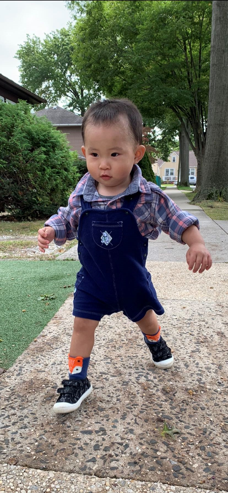

# This is my first and awesome website
It is a great fun learning data science using R studio

# P8015 homework 4
Our data science class website is [p8105](https://www.p8105.com/index.html)
I am analysis the [NOAA](https://www.ncei.noaa.gov/products/land-based-station/global-historical-climatology-network-daily)data.
You can see the short data description here[NOAA data description](NOAA_data.html)

I am studying epidemiology at Columbia University - Mailman School of Public Health. If you want know more about my school.Here is the link 
[Mailman School of Public Health](https://www.publichealth.columbia.edu/)

Here's my Curriculum Vitea [Yu's CV](Yu_CV.html)page

# Here's My favorate soccer team's youtube channel

[MU youtube](https://www.youtube.com/c/manutd)

# My baby 
My baby's name is Lucas. He likes to be playing around when I am working on my data science homework. Here he is:

